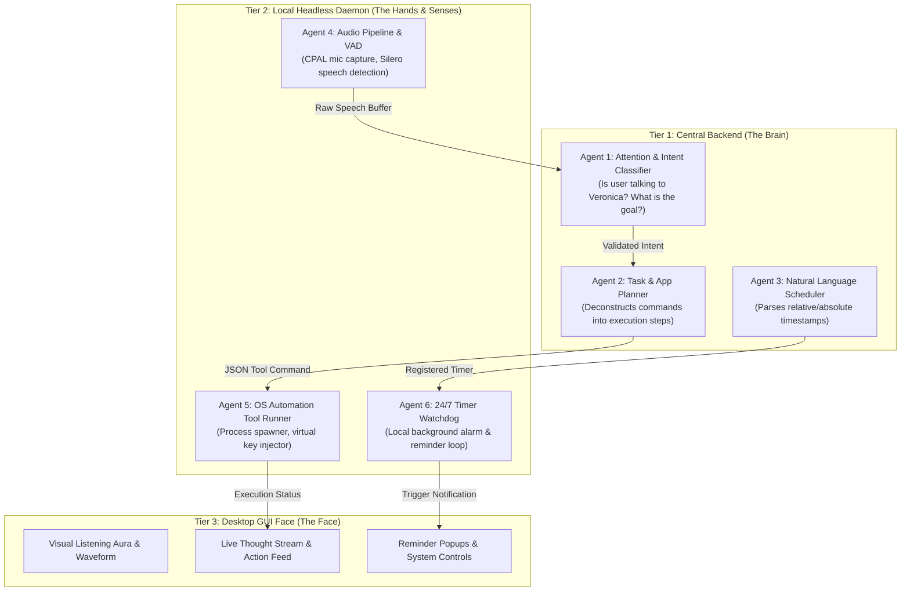

# Project Veronica: Version 1.0 Product & Architectural Specification

```text
Document ID:     VER-SPEC-V1
Title:           Version 1.0 (V1) Scope, Multi-Agent Topology & Functional Specification
Classification:  Internal Product & Architecture Specification
Target Release:  Project Veronica V1.0 ("The Aware Assistant")
Status:          APPROVED FOR IMPLEMENTATION
```

---

## 1. Executive Summary & V1 Vision

**Project Veronica Version 1.0 (V1)** transforms Project Veronica from a scaffolded architecture into an active, **socially aware, voice-enabled, and OS-automating personal AI assistant**.

Unlike conventional assistants that trigger blindly on keywords or force users to type, **Veronica V1** introduces:
1. **Contextual Attention & Social Awareness**: The intelligence to determine whether the user is speaking to Veronica or to another person in the room/on the phone, knowing when to respond, when to pause, and when to stay silent.
2. **Local Application Orchestration**: The capability to open, close, and manipulate single or grouped applications (e.g., launching an entire "Workstation Setup", controlling media playback, and automated note-taking).
3. **Autonomous Background Scheduling**: A persistent background timer engine that manages reminders, tasks, and alerts 24/7 without requiring the user interface to be open.

---

## 2. Core Feature Specifications

### Feature 1: Contextual Voice & Attention Awareness Engine
* **The Problem**: Standard voice assistants wake up inappropriately, speak over users, and cannot tell if a user is talking to them, talking to family, or answering a phone call.
* **V1 Solution**:
  * **Addressee Classification**: When speech is detected, the audio/transcript is analyzed for direct address markers, syntax, tone, and conversational context to determine:
    - `DIRECT_ADDRESS`: The user is explicitly conversing with Veronica ➔ Process & Respond.
    - `BACKGROUND_SPEECH`: The user is speaking to someone else in the physical room ➔ Suppress response, remain silent.
    - `PHONE_CALL_MODE`: The user is on a call ➔ Deactivate voice prompts, switch to silent text-only logging.
  * **Intelligent Turn-Taking & Interruption (Barge-In)**:
    - If Veronica is speaking and the user begins talking, Veronica immediately cuts audio playback within `< 100ms` (Barge-In).
    - If the user pauses mid-sentence to think, Veronica does not interrupt prematurely.

### Feature 2: Local Application Orchestration & Interaction ("The Hands")
* **The Problem**: Users have to manually launch multiple apps, configure window setups, and control music/video playback.
* **V1 Solution**:
  * **Single & Group App Management**:
    - **Single App**: "Open Spotify", "Close Chrome".
    - **App Groups / Workspaces**: "Launch my Dev Setup" ➔ Simultaneously boots VS Code, Windows Terminal, and Spotify.
  * **App Interaction & Media Control**:
    - **Media Control**: Play, pause, skip track, volume adjustment via native Windows virtual key injection.
    - **Data Capture & Typing**: Ability to capture selected clipboard data, draft notes, or simulate text input into active windows.

### Feature 3: Autonomous Background Scheduler & Reminders
* **The Problem**: Existing web-based reminder tools fail if your browser is closed, or require complex manual calendar clicking.
* **V1 Solution**:
  * **Natural Language Parsing**: "Remind me to check the oven in 25 minutes", "Set a reminder every weekday at 9 AM to review pull requests".
  * **Persistent Daemon Watchdog**: Scheduled timers are registered directly with the 24/7 Rust Daemon. If the GUI is closed or the computer screen locks, the daemon's internal Tokio timer fires local Windows toast notifications and audio alerts on time.

---

## 3. Multi-Agent Topology for V1

To ensure strict adherence to our decoupled 3-tier architecture, responsibilities are delegated to specialized sub-agents across tiers:



### Agent Responsibility Matrix

| Agent Name | Location | Primary Responsibility | Input ➔ Output |
| :--- | :--- | :--- | :--- |
| **Attention & Intent Classifier** | `backend/` | Distinguishes whether speech is addressed to Veronica; filters background noise. | Raw Transcript ➔ Intent Enum (`Direct`, `Ignore`, `Pause`) |
| **Task Planner Agent** | `backend/` | Breaks complex requests into a sequence of tool calls. | "Open work setup" ➔ `[Launch("code.exe"), Launch("wt.exe")]` |
| **NL Scheduler Agent** | `backend/` | Converts human time phrases into ISO timestamps. | "in 45 mins" ➔ `2026-09-13T19:54:00Z` |
| **Audio Capture & VAD** | `daemon/` | Captures microphone input; detects speech start/stop. | Hardware Mic ➔ Audio Buffers + Voice Activity Booleans |
| **OS Tool Runner** | `daemon/` | Spawns Windows processes, kills tasks, sends media keystrokes. | JSON Tool Calls ➔ Windows API / Process Execution |
| **24/7 Timer Watchdog** | `daemon/` | Maintains local priority queue of timers and fires alerts. | Scheduled Jobs ➔ Windows Notifications & Audio Chimes |

---

## 4. Inter-Tier Protocol Contracts (V1 Additions)

The following packet types expand our shared `protocol.rs` (Rust) and `protocol.ts` (TypeScript) for V1:

### 4.1 Daemon ➔ GUI Packets
```json
// Attention State Change
{
  "type": "ATTENTION_STATE",
  "payload": {
    "state": "LISTENING" // "LISTENING" | "PROCESSING" | "SPEAKING" | "IGNORING_BACKGROUND"
  }
}

// OS Action Log
{
  "type": "ACTION_LOG",
  "payload": {
    "action": "APP_LAUNCHED",
    "target": "Spotify",
    "status": "SUCCESS"
  }
}

// Reminder Notification Trigger
{
  "type": "REMINDER_TRIGGER",
  "payload": {
    "id": "rem_10928",
    "message": "Check the oven",
    "scheduled_time": "19:35:00"
  }
}
```

### 4.2 GUI / Backend ➔ Daemon Packets
```json
// Execute App Group
{
  "type": "EXECUTE_APP_GROUP",
  "payload": {
    "group_name": "Workstation",
    "apps": ["code", "windowsterminal", "spotify"]
  }
}

// Media Control Command
{
  "type": "MEDIA_COMMAND",
  "payload": {
    "action": "PLAY_PAUSE" // "PLAY_PAUSE" | "NEXT" | "PREV" | "VOLUME_UP" | "VOLUME_DOWN"
  }
}

// Register Scheduled Reminder
{
  "type": "REGISTER_REMINDER",
  "payload": {
    "id": "rem_10928",
    "timestamp": 1789410900,
    "message": "Check the oven"
  }
}
```

---

## 5. V1 Phased Implementation Roadmap

To maintain velocity while learning, V1 is divided into four focused milestones:

* **Milestone 1: The Local Hands (OS Application & Media Automation)**
  * Implement Windows process launcher in `daemon/src/system/command.rs`.
  * Implement Windows virtual media key injector (Play/Pause, Next, Volume).
  * Wire GUI buttons / WebSocket commands to verify app launching on your screen.
* **Milestone 2: The 24/7 Scheduler & Watchdog**
  * Build the Tokio background timer queue in `daemon/src/system/scheduler.rs`.
  * Trigger local Windows alerts and desktop notifications when timers expire.
* **Milestone 3: The Ears (Audio Capture & Voice Activity Detection)**
  * Implement microphone capture via `cpal` in `daemon/src/audio/capture.rs`.
  * Integrate lightweight Voice Activity Detection (VAD) to detect human speech in real-time.
  * Stream live audio amplitude to the GUI's pulsing aura ring.
* **Milestone 4: The Social Brain (Attention & Conversational Awareness)**
  * Connect Daemon audio to Backend transcription and intent classification.
  * Implement Addressee Detection (Is the user speaking to Veronica or someone else?).
  * Implement Barge-In (stopping Veronica immediately when the user speaks).

---

## 6. Document Approval
* **Lead Architect**: Lead Engineer & Veronica Co-Pilot
* **Execution Status**: Approved. Implementation begins with **Milestone 1 (The Local Hands)**.
